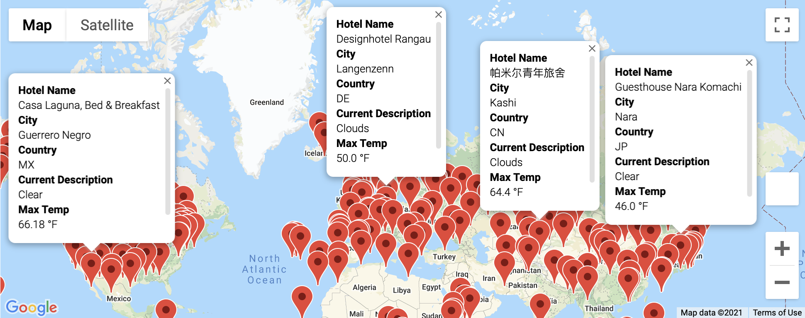
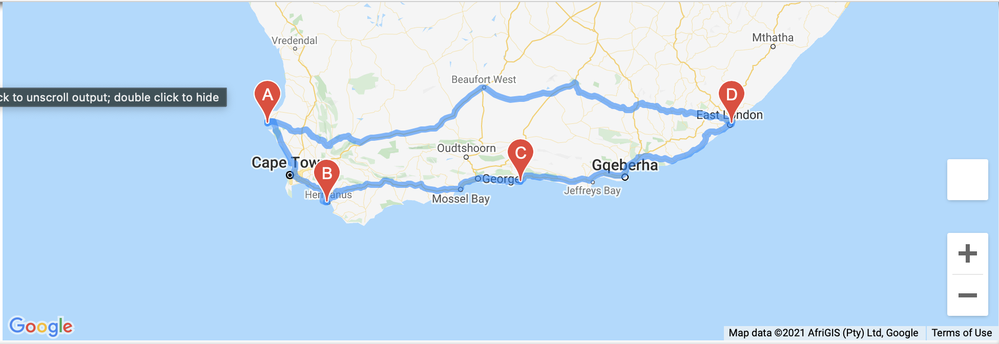
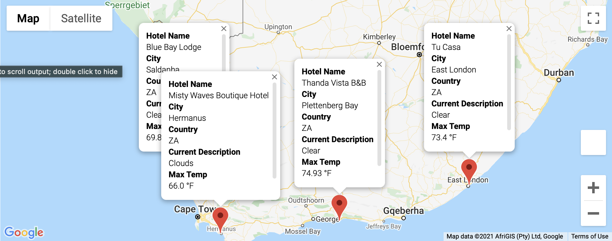

# World_Weather_Analysis
A project for UT Austin Data Analysis Bootcamp

## Project Overview
A travel company requested we create a program that could help their customers find suitable places to travel based on weather preferences. We used APIs to get weather data from OpenWeatherMap for an assortment of global locations. We then used GoogleMaps to recommend nearby hotels and find driving routes between cities. We displayed this information using the GoogleMaps API.

## Resources
- OpenWeatherMap API (https://openweathermap.org)
- GoogleMaps API
- GoogleDirections API

## Summary
We generated a list of latitude and longitude coordinates and found nearby cities using Citypy. Then we used OpenWeatherMap's API to find current weather conditions for each location. Using Google Maps we generated a world map with markers displaying the weather conditions across the globe.

Then we selected four cities based on our desired temperature range and used GoogleDirections API to find a route between them.

Finally, we located hotels in those cities using Google Maps and displayed them on markers.

